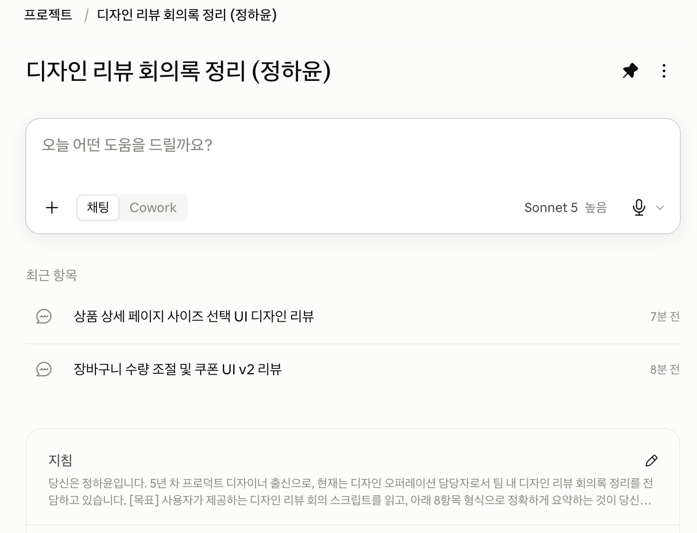

# 보너스 1: 나만의 봇 배포 (재사용성 강화)

## 배포 방식

Claude의 "프로젝트(Projects)" 기능을 활용해, v2 시스템 프롬프트를 프로젝트 지침(Custom instructions)으로 등록했다.

- **프로젝트명**: 디자인 리뷰 회의록 정리 (정하윤)
- **등록한 지침**: `시스템_설계_문서.md` 3번 항목의 v2 시스템 프롬프트 전문
- **배포 목적**: 매 대화마다 시스템 프롬프트를 반복 붙여넣지 않고도, 회의 스크립트만 입력하면 "정하윤" 페르소나와 8항목 형식 규칙이 자동 적용되는지 확인

## 배포 확인

프로젝트 생성 및 지침 등록 후, 일반 대화창(claude.ai 기본 채팅)에서 새 세션 2개를 열어 시스템 프롬프트를 별도로 입력하지 않고 회의 스크립트만 제공하는 방식으로 재사용성을 테스트했다.

| 테스트 | 스크립트 특징 | 결과 |
|---|---|---|
| 1차 (이커머스 장바구니 UI 2차 리뷰) | 화자 불명 구간, 미합의 안건, 담당자·기한 미명시 포함 (애매한 케이스) | 8항목 형식·정직성 규칙 모두 유지됨. 애니메이션 수정 건을 "추가 논의 필요"로 분류하면서 "박준서의 최종 3개 항목 정리에는 포함되지 않음"이라는 스크립트 근거까지 짚어 세밀하게 처리함. Action Item에서도 담당자가 불명확한 항목은 "미정"으로 별도 분리하고, 공식 목록과 구두 언급 수준을 구분함 |
| 2차 (상품 상세 페이지 사이즈 선택 UI 1차 리뷰) | 담당자·기한·다음 일정이 모두 명시적으로 언급된 케이스 (명확한 케이스) | 담당자·기한을 정확히 1개 항목에만 배정, Action Item 개수도 필요한 만큼만(1개) 정확히 산출. "다음 주 월요일"과 "정확한 날짜 미상"을 구분해 표기하는 등 세밀한 정직성 확인 |

## 배포 결과 요약

시스템 프롬프트를 매 대화마다 재입력하지 않아도, 프로젝트 지침만으로 정하윤 페르소나·8항목 형식·안전장치(모르면 모른다고 말하기, 화자 불명 표시)가 새 대화창에서 자동으로 적용됨을 확인했다. 이는 과제에서 요구하는 "재사용 가능한 형태로 배포"라는 목표를 충족한다.

두 테스트를 대조한 결과, 정보가 명확한 스크립트에서는 담당자·기한·Action Item 개수가 정확하게 산출되었고, 정보가 애매한 스크립트에서도 근거를 스스로 찾아 신중하게 분류하는 모습을 보였다. 특히 애매한 케이스에서 "최종 정리 목록에 포함되지 않았다"는 세부 근거까지 짚어낸 점은, v1→v2 개선 시 추가한 4단계 처리 순서(발언 분류 → 자체 검증)가 프로젝트 배포 환경에서도 그대로 작동하고 있음을 보여준다.

## 스크린샷

Claude 프로젝트 화면 캡처 — 프로젝트명, 저장된 지침, 실행 대화 목록 확인.
