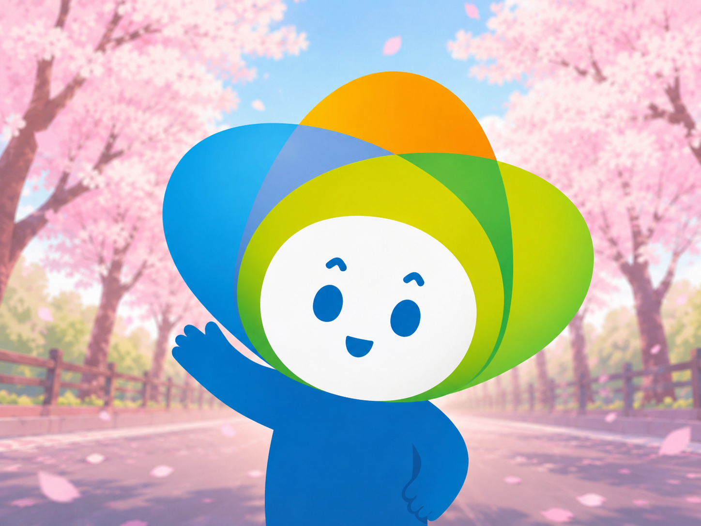
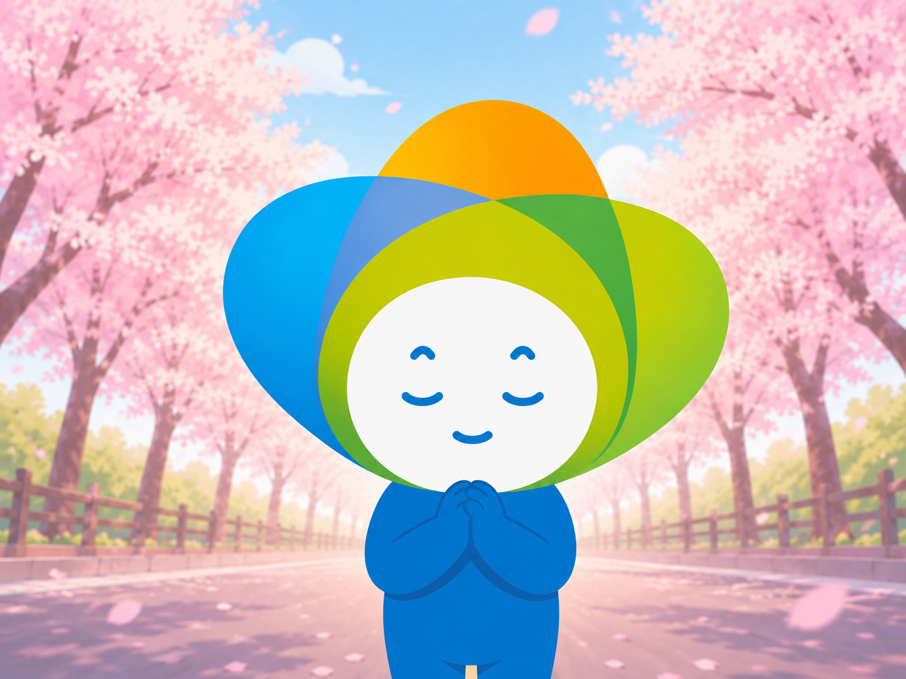
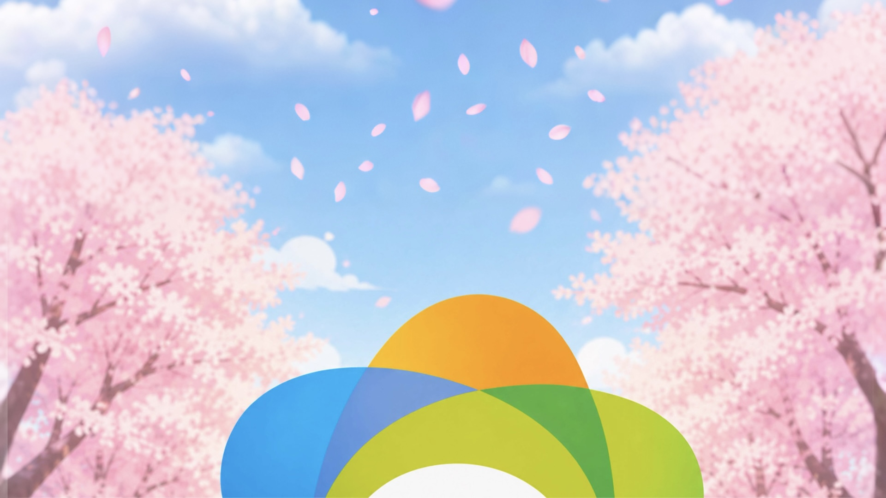
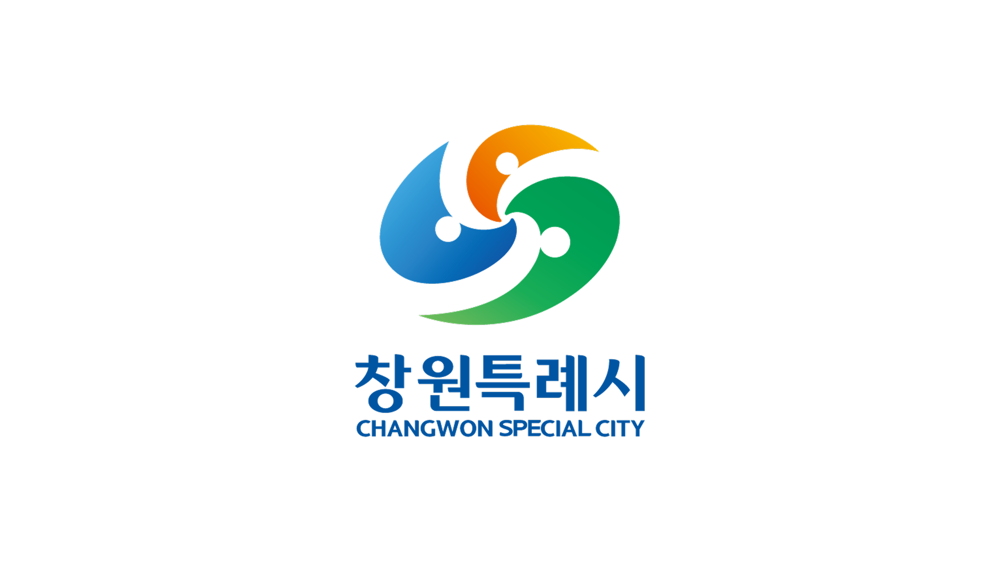

# 피우미 브랜드 광고 캠페인

창원특례시 공식 마스코트 **피우미**를 활용한 10초 이내 감성 브랜드 광고 제작 프로젝트.
Codyssey **GenAI 기초 2: 멀티모달 콘텐츠 제작** 과제 제출물입니다.

> 핵심 메시지: **"피우미와 함께, 창원의 봄을 틔우다"**

## 🎯 브랜드 아이덴티티

| 항목 | 내용 |
|---|---|
| 타겟 | 창원 거주 시민 (전 연령, 특히 지역 SNS·뉴스를 소비하는 일반 시민) |
| 톤앤매너 | 귀엽고 발랄함 — 순수하고 하이톤인 어린아이 목소리, 파스텔톤 벚꽃 색감, 플랫 2D 벡터 일러스트 |
| USP(차별점) | 딱딱한 행정 마스코트가 아니라, "발견→인사→기원→브랜드 각인"이라는 감성적 서사로 다가가는 친근한 동반자형 캐릭터 |
| 광고 목적 | 인지도(Awareness) — 창원 시민에게 마스코트 '피우미'를 처음 알리고 친근감 형성 |

(브랜드 스토리, 색상 상징 등 상세 내용은 [스토리보드 문서](./스토리보드_기획문서.pdf) 1장 참고)

## 🎨 소재 사용 정책

이 프로젝트는 **직접 촬영(라이브 액션) 및 유료 스톡 이미지/영상을 일체 사용하지 않았습니다.** 모든 시각·음성 자산은 생성형 AI로 제작했으며, 유일한 예외는 창원시가 공식 배포한 브랜드 자산(심벌마크, 캐릭터 매뉴얼)이며 이는 저작권상 창원시 소유의 기존 자산이므로 별도로 명시합니다.

| 자산 종류 | 출처 |
|---|---|
| 배경·캐릭터 정지 이미지 | ChatGPT(GPT-4o) 생성 |
| 영상(모션) | Kling AI 3.0 생성 |
| 나레이션 음성 | Vrew TTS 생성 |
| 배경음악 | Suno 생성 |
| 로고/심벌마크 | 창원시 공식 배포 브랜드 자산 (AI 생성 아님, 원본 그대로 사용) |

## 📄 제출물

| 항목 | 파일 |
|---|---|
| 스토리보드 기획 문서 (PDF) | [`스토리보드_기획문서.pdf`](./스토리보드_기획문서.pdf) |
| 최종 광고 영상 (MP4, 9.97초) | [`광고_영상_파일.mp4`](./광고_영상_파일.mp4) |

## 🎬 미리보기

<p align="center">
  
  
  
  
</p>
<p align="center"><sub>씬1 손인사 · 씬2 소원빌기 · 씬3 로고 변형(시작 프레임) · 씬4 브랜드 마무리</sub></p>

최종 영상 재생 (GitHub 업로드 후 아래 태그로 재생 가능):

```html
<video src="./광고_영상_파일.mp4" controls width="480"></video>
```

## 📁 폴더 구조

```
B1-2-multimodal-content/
├── README.md
├── 스토리보드_기획문서.pdf        # 기획 문서 (브랜드 정의·씬별 프롬프트·도구 비교 등)
├── 광고_영상_파일.mp4             # 최종 제출 영상 (1080p·30fps·H.264/AAC·9.97초)
└── assets/                         # 씬별 생성 원본 자산 (기획 문서 파일명 표기와 1:1 매칭)
    ├── images/
    │   ├── scene1_image_final.png
    │   ├── scene2_image_final.png
    │   ├── scene3_startframe_final.jpg / scene3_endframe_final.jpg
    │   ├── scene4_logo_card_asset.png             # 공식 브랜드 자산(투명배경 고해상도)
    │   └── scene0_walking_image_notused.png       # 초기 기획 씬(최종 미포함)
    ├── videos/
    │   ├── scene1_video_final.mp4
    │   ├── scene2_video_candidate_notused.mp4     # 소원빌기용 영상 후보(최종컷은 정지이미지 팬/줌 채택)
    │   ├── scene3_video_part1.mp4 / scene3_video_final.mp4   # 로고 변형 최종 2파트
    │   ├── scene3_draft_4petals_issue.mp4         # 프롬프트 수정 전(꽃잎 4개 오류)
    │   ├── scene3_draft_closespacing_issue.mp4    # 프롬프트 수정 중간본(간격 오류)
    │   ├── scene0_walking_video_notused_v1.mp4
    │   └── scene0_walking_video_notused_v2.mp4    # 초기 기획 씬 후보(최종 미포함, 비율 문제로 제외)
    └── audio/
        ├── narration_scene1_hello.mp3
        ├── narration_scene2_wish.mp3
        └── bgm_source_full.mp3                    # Suno 원곡(편집 시 필요 구간만 트리밍)
```

## 🛠 사용 도구

| 용도 | 도구 |
|---|---|
| 이미지 생성 | ChatGPT (GPT-4o) |
| 비디오 생성 | Kling AI 3.0 |
| 오디오(나레이션 TTS) | Vrew |
| 오디오(BGM) | Suno |
| 편집 | VITA |

자세한 선정 이유, 씬별 프롬프트 원문, 수정 전/후 비교는 [스토리보드 문서](./스토리보드_기획문서.pdf)를 참고하세요.

### T2I vs I2V — 어떤 상황에 어떤 방식을 썼나

- **T2I(Text-to-Image, ChatGPT)**: 텍스트만으로 정지 이미지를 새로 생성. 구도·포즈·표정을 빠르게 여러 버전으로 실험하기 좋아서, 캐릭터 디자인·구도를 확정하는 단계에서 사용.
- **I2V(Image-to-Video, Kling AI 3.0)**: 이미 확정된 정지 이미지(또는 시작·끝 프레임 2장)를 기반으로 그 사이의 움직임만 생성. 캐릭터 일관성을 유지한 채 모션만 얹기 좋아서, 디자인이 확정된 뒤 모션을 붙이는 단계에서 사용.
- **선택 기준**: "그림을 새로 만들어야 하나(T2I) vs 이미 있는 그림을 움직이기만 하면 되나(I2V)"로 구분해서 도구를 선택함.

### 도구 선택 우선순위

| 자산 종류 | 우선순위 | 이유 |
|---|---|---|
| 이미지 | **품질 우선** | 브랜드 캐릭터 정확도(매뉴얼 규정 준수)가 핵심이라, 여러 번 재생성해서라도 일치시킴 |
| 영상 | 속도·비용 우선 | 3~4초 짧은 클립이라 도구 간 품질 차이가 체감상 크지 않아 저비용/고속 도구를 우선 채택 |
| 오디오 | 비용 우선 | 무료 도구(Vrew, Suno)로도 충분한 완성도 확보 가능해 비용을 최우선으로 고려 |

### 대체 도구 비교 (다른 도구로 제작했다면?)

| 카테고리 | 채택 도구 | 예상 품질 | 비용 | 속도 | 대체 후보 | 대체 시 예상 변화 |
|---|---|---|---|---|---|---|
| 이미지 생성 | ChatGPT(GPT-4o) | 상 | 무료~저가 | 보통 | Gemini | 벚꽃 디테일·로컬 정체성·역광 처리 품질 하락 (본문 도구 비교 참고) |
| 영상 생성 | Kling AI 3.0 | 상 | 무료 크레딧 | 보통 | Runway, Pika | Runway는 품질은 유사하나 무료 크레딧이 1회성(125크레딧)이라 비용 급증, 워터마크 이슈 |
| 나레이션 TTS | Vrew | 중상 | 무료 | 빠름 | 브라우저 내장 TTS | 비용은 동일(무료)하나 톤 조절 자유도가 낮아져 품질 하락 |
| BGM | Suno | 상 | 무료 크레딧 | 보통 | 무료 로열티프리 스톡 BGM | 비용은 유사하나 "봄/벚꽃 무드에 맞춘 커스텀"이 불가능해 톤 일치도 하락 |

### 제작 워크플로우 & 검수 기준

기획 → 생성 → 검수 → 편집의 4단계로 진행하며, 각 단계마다 아래 기준으로 검수함:

1. **기획**: 씬별 목표 메시지·화면 구성·나레이션을 스토리보드에 먼저 문서화 → 프롬프트 작성 전 확정
2. **생성**: 공식 캐릭터 매뉴얼(턴어라운드·색상 가이드·표정/동작 시트)을 레퍼런스로 첨부해 이미지→영상→오디오 순으로 생성
3. **검수** (매 씬 완성 직후 체크):
   - [ ] 머리 3색 배치·색상값이 매뉴얼 Pantone 가이드와 일치하는가
   - [ ] "형태 임의 변경 불가" 규정(머리 비율/다리 길이/색상 반전 금지) 위반이 없는가
   - [ ] 영상 해상도·비율이 16:9(1920×1080 또는 1280×720)인가
   - [ ] 선(linework) 떨림·플리커링이 없는가
   - [ ] 이전 씬과 배경 톤·조명 방향이 일치하는가
4. **편집**: VITA에서 컷 편집·크롭(비율 보정)·자막·오디오 믹싱 → 전체 이어붙인 뒤 과제 요구사항 체크리스트(본문 하단) 최종 대조

### 씬별 규격 및 색감 통일 지침

| 항목 | 목표 규격 | 비고 |
|---|---|---|
| 최종 영상 해상도 | 1920×1080 (16:9) | 30fps, H.264/AAC |
| 개별 소스 생성 해상도 | 도구별 상이 (1448×1086, 1920×1080, 1280×720 등) | 편집 단계에서 16:9로 크롭/맞춤 |
| 색공간 | sRGB | 모든 생성 도구 기본값 사용, 별도 변환 없음 |
| 톤 통일 방법 | 모든 씬 프롬프트에 "같은 파스텔톤, 늦은 오전 햇살" 문구를 고정 삽입 | 프롬프트 단계에서부터 통일 관리 |

**해상도/색감 불일치 보정 절차** (실제로 씬1·씬2 영상이 4:3 계열로 나왔던 사례에 적용한 절차):
1. 신규 생성 이미지·영상을 직전 씬 스크린샷과 나란히 놓고 하늘색·벚꽃색 계열 육안 대조
2. 조명 방향(역광 여부)이 이전 씬과 일치하는지 확인
3. 캐릭터 3색을 매뉴얼 Pantone 값과 대조
4. 비율이 16:9가 아니면 VITA에서 크롭하여 통일 (색조 자체는 변경하지 않음 — 밝기/채도 미세조정만 허용)
5. 최종 이어붙이기 전 전체 씬 썸네일을 한 화면에 나란히 놓고 육안 검수

### 캐릭터·스타일 고정 및 후처리 방법

- **레퍼런스 고정**: 매 생성 시 공식 캐릭터 매뉴얼 시트 + 직전 씬에서 채택된 이미지를 함께 첨부하여, 텍스트 묘사만으로는 담보되지 않는 디테일(선 굵기, 그라데이션 방향 등)을 일관되게 유지
- **후처리 워크플로우**: VITA에서 ①크롭(비율 보정) → ②컷 편집(트림/전환) → ③자막 삽입 → ④오디오 믹싱(나레이션+BGM 레벨 조정) 순으로 진행. 색보정은 밝기·채도 미세조정 범위 내로 제한하고, 색조(hue) 자체는 변경하지 않아 생성 단계의 색상 값을 그대로 보존함

### 크레딧 부족 시 대응 전략

| 우선순위 | 대응 | 실제 적용 사례 |
|---|---|---|
| 1순위 | 정지 이미지 + 팬/줌으로 대체(영상 생성 자체를 생략) | 씬2(소원빌기) — 별도 영상 없이 정지 이미지를 VITA 팬/줌으로 처리 |
| 2순위 | 씬을 여러 파트로 나눠 생성하지 않고 1파트로 축소 | 씬3(로고 변형)을 필요 시 파트1 생략, 파트2(핵심 모션)만 사용 |
| 3순위 | 영상 대신 정지컷+자막으로 대체 | 씬1(손인사) 립싱크 영상이 실패할 경우의 백업 방안으로 검토 |
| 4순위(최후) | 씬 자체를 제외 | 씬0(뒷모습 걷기) — 10초 제한 및 비율 문제로 최종 제외 |

**우선 교체 도구 목록**: 이미지 ChatGPT→Gemini / 영상 Kling→Runway·Pika / TTS Vrew→브라우저 내장 TTS / BGM Suno→무료 로열티프리 스톡

### 확장 시나리오 — 60초·15초 버전 제작 시

현재 제출물은 10초 이내지만, 향후 더 긴 버전으로 확장 요청받을 경우를 대비한 원칙:

- **유지 우선순위**: 씬4(브랜드 마무리) > 씬3(로고 변형) > 씬1(손인사) > 씬2(소원빌기) > 씬0(뒷모습 걷기, 확장판에서만 복원)
- **15초 확장**: 현재 4씬 유지 + 씬0(뒷모습)을 도입부로 복원해 "발견→인사→기원→로고→브랜드"의 5단계 서사로 확장, 각 씬 길이를 비례 증가
- **60초 확장**: 각 씬을 3~5배로 늘리고, 창원 명소 몽타주나 시민 인터뷰형 씬을 추가로 삽입 검토
- **메시지 재구성 원칙**: 러닝타임이 늘어날수록 "설명"보다 "감정 전달"에 더 많은 시간을 배분하되, 핵심 메시지 문장("피우미와 함께, 창원의 봄을 틔우다")은 길이와 무관하게 항상 마지막 장면에 고정 노출

## ✅ 과제 요구사항 체크리스트

- [x] 브랜드 아이덴티티 / 캠페인 목표 / 핵심 메시지 / 타겟·톤앤매너·USP 정의
- [x] 씬 단위 스토리보드 (필수 필드 전부 기재)
- [x] 프롬프트 "수정 전/후" 비교 기록 (씬3, 2건)
- [x] 이미지·비디오·오디오 생성 AI 각 1종 이상 사용
- [x] 직촬·유료 스톡 미사용 명시 및 대체 AI 자산 안내
- [x] 10초 이내 (9.97초)
- [x] 마지막 3~5초 구간 내 브랜드 인지 장치(로고+브랜드명) 포함
- [x] 명확한 메시지 전달 구조 (발견→메시지→브랜드 연결→마무리)
- [x] 기획→생성→검수→편집 워크플로우 및 검수 기준 문서화
- [x] 씬별 해상도·비율·색공간 규격 및 색감 통일 지침
- [x] T2I/I2V 차이 및 도구 선택 우선순위(품질/속도/비용) 명시
- [x] 대체 도구별 예상 품질·비용·속도 비교
- [x] 크레딧 부족 시 대응 전략(씬 축소 우선순위 + 대체 도구)
- [x] 60초·15초 확장 시나리오(유지 우선순위 + 메시지 재구성 원칙)
- [x] 보너스1: 립싱크 적용 (씬1)
