# 자동화 도구 비교 구현 — Make vs Zapier

**워크플로우**: 채용공고 관심도 자동 분류
`Google Form 제출 → 조건 분기(UX/프로덕트 키워드) → Google Sheets 기록 + Slack 알림`

---

## 1. 사용한 도구

| 도구 | 플랜 |
|---|---|
| Make | 무료 플랜 (월 1,000 Operations) |
| Zapier | Professional 14일 무료 체험 |

두 도구 모두 아래의 동일한 구조로 구현했다.

```
Google Forms (Trigger)
 └─ 분기
     ├─ 경로 A: 조건(공고 제목에 UX/UI/프로덕트/Product/PD 중 하나 이상 포함, OR)
     │          → Google Sheets(관심공고 탭에 행 추가) → Slack 알림
     └─ 경로 B: Fallback(나머지 전부) → Google Sheets(보류공고 탭에 행 추가)
```

Trigger 1개, Action 3개(Sheets×2 + Slack), 조건 분기 1개로 과제의 공통 요구사항을 충족했으며, 두 경로 모두 실제 채용공고 데이터로 1회 이상 실행을 검증했다.

---

## 2. Make 구현 과정 요약

**전체 워크플로우 구조** (Google Forms → Router → 관심공고 경로/보류공고 경로 전체, 모든 모듈 실행 성공 확인)

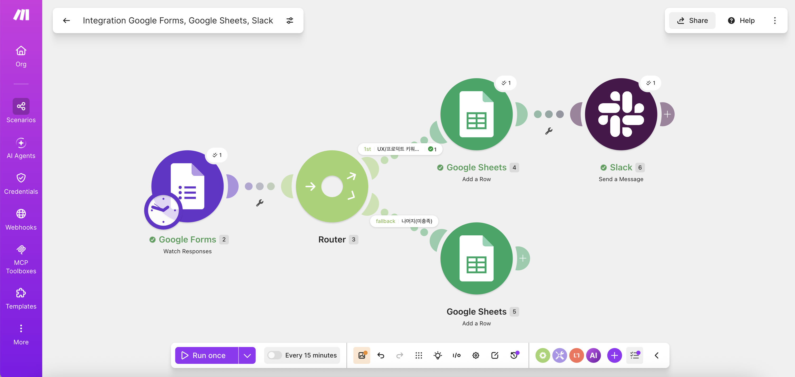

1. **Trigger**: Google Forms `Watch Responses` 모듈을 추가하고, 시작 시점을 `From now on`으로 설정해 실행 시점 이후의 새 응답만 처리하도록 구성했다.

   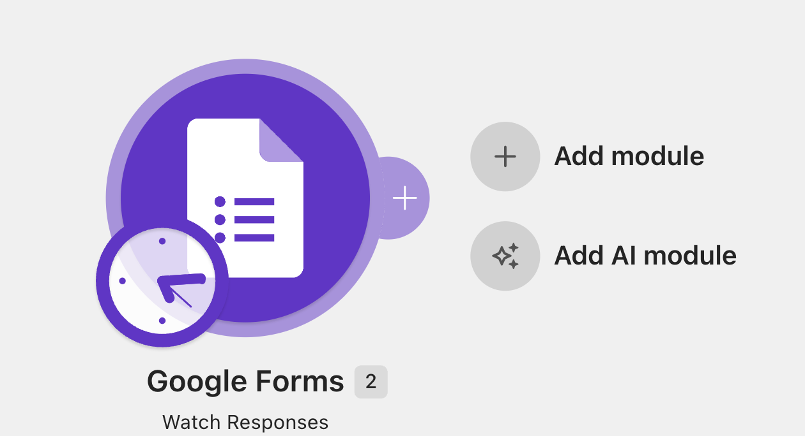

2. **분기(Router)**: `Router` 모듈을 추가해 경로를 두 갈래(1st/2nd)로 나눴다. Make의 Router는 분기만 담당하고, 실제 조건 판단은 각 경로 뒤에 붙는 Filter가 수행하는 구조다.

   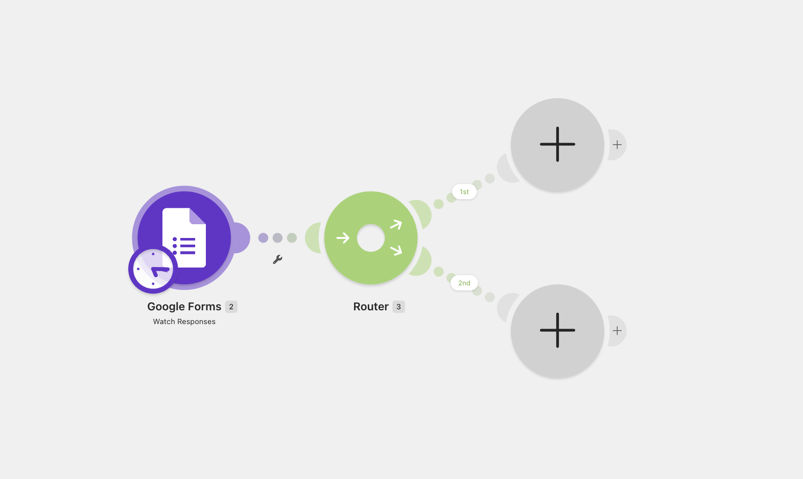

3. **조건 필터**: 1st 경로에 `공고 제목 Contains (case insensitive) UX/UI/프로덕트/Product/PD`를 OR로 묶은 5중 조건을 걸었다. 2nd 경로는 별도 조건 없이 `Fallback route: Yes`로 설정해 "1st에 걸리지 않은 나머지 전부"를 받도록 했다.

   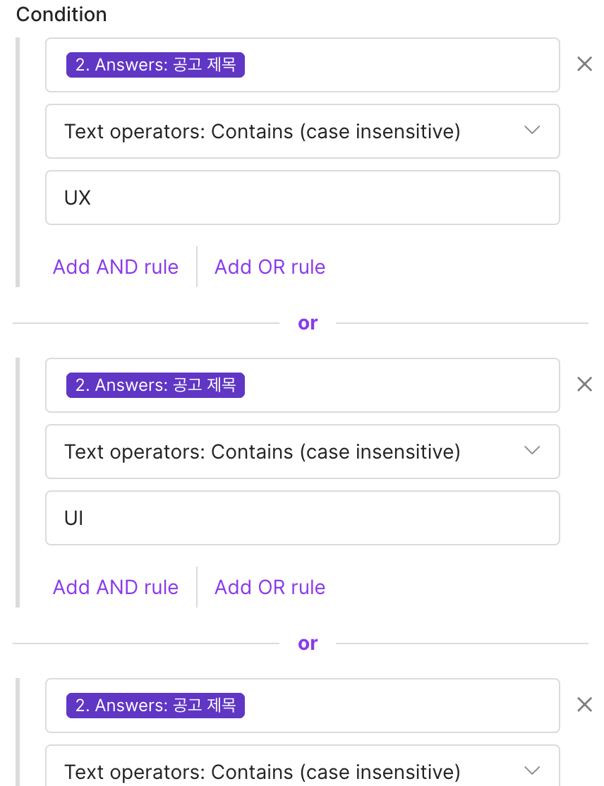

4. **데이터 매핑 이슈와 해결**: Google Forms 응답 필드는 `Answers → textAnswers → answers[] → value`의 4단계 중첩 구조로 되어 있었다. 처음에는 상위 단계(오브젝트 전체)를 그대로 매핑해 시트에 JSON 원본이 찍히는 문제가 발생했고, 화살표를 끝까지 펼쳐 최하위 `value`까지 도달해서야 정상적인 텍스트 값을 얻을 수 있었다.

   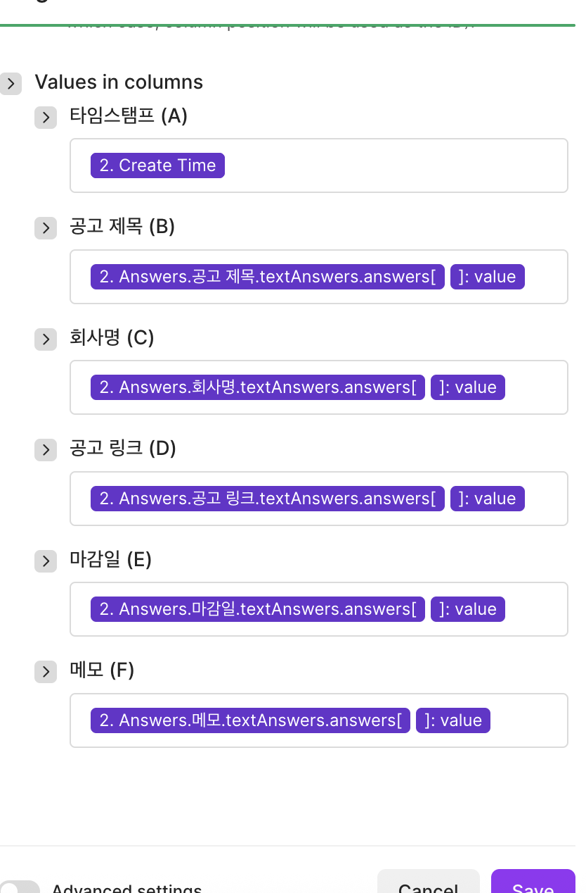

5. **API 사용량 제한 이슈**: 짧은 시간에 `Run once`를 반복 실행하면서 Google Forms API의 `429 RESOURCE_EXHAUSTED` (Expensive Reads 쿼터 초과) 오류를 겪었다. 1~2분 대기 후 재시도로 해결했다.

   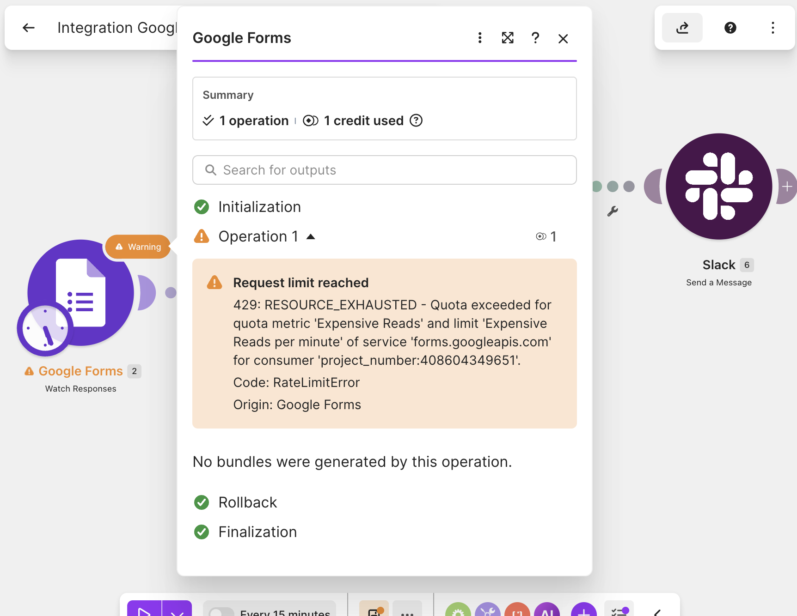

6. **실행 결과**: 모든 매핑을 수정한 뒤 재검증한 결과, 관심공고/보류공고 두 경로 모두 정상적으로 데이터가 기록되고 Slack 알림도 깨끗한 텍스트로 도착했다.

   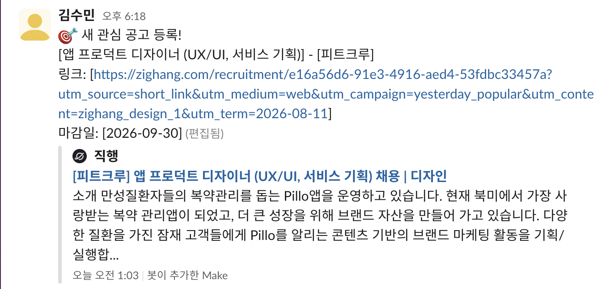
   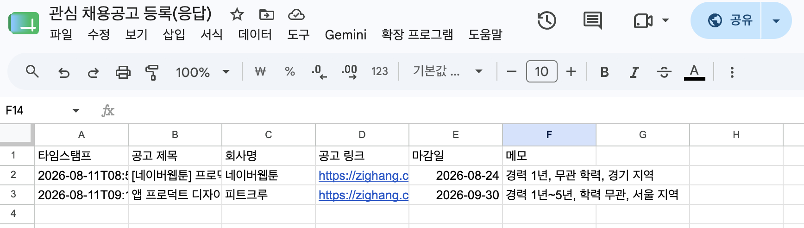

---

## 3. Zapier 구현 과정 요약

**전체 워크플로우 구조** (Google Forms → Paths → Path A(관심공고)/Fallback(보류공고) 전체, v1 활성화 상태)

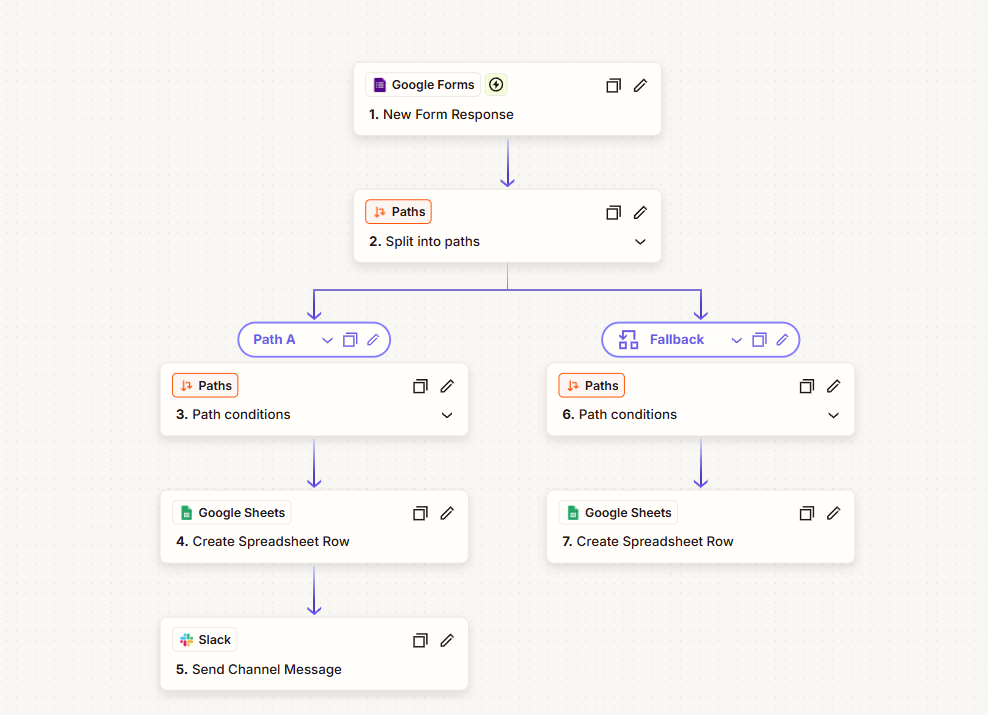

1. **가입 및 체험판**: Zapier 무료 플랜은 Trigger 1개 + Action 1개(2단계)만 지원하며 조건 분기와 멀티스텝을 지원하지 않아, 본 과제 구조를 구현하려면 Professional 14일 무료 체험이 필요했다. 신용카드 등록 없이 체험판이 자동 적용됐다.

2. **Trigger**: Google Forms `New Form Response` 이벤트를 선택했다. Make의 `Watch Responses`(폴링 방식)와 달리 `Instant`(웹훅 방식) 태그가 붙어 있어, 응답 제출 즉시 실행되는 구조임을 확인했다.

3. **분기(Paths)**: `Paths` 모듈을 추가하자 Path A/B 구조와 각 경로의 조건·액션 자리가 자동으로 생성됐다.

   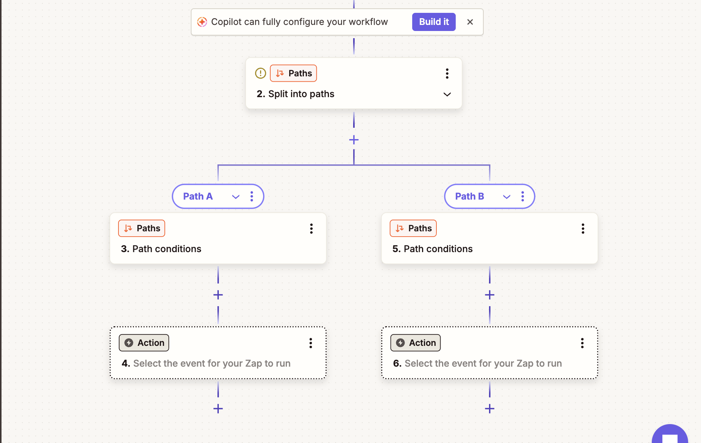

4. **데이터 필드 확인**: 트리거 필드 목록을 열어보니 `공고 제목`, `회사명` 등 모든 필드에 실제 텍스트 값이 바로 미리보기로 붙어 있었다. Make에서 4단계 중첩을 직접 뚫어야 했던 것과 달리, Zapier는 데이터를 미리 평탄화(flatten)해서 제공한다는 차이를 확인했다.

   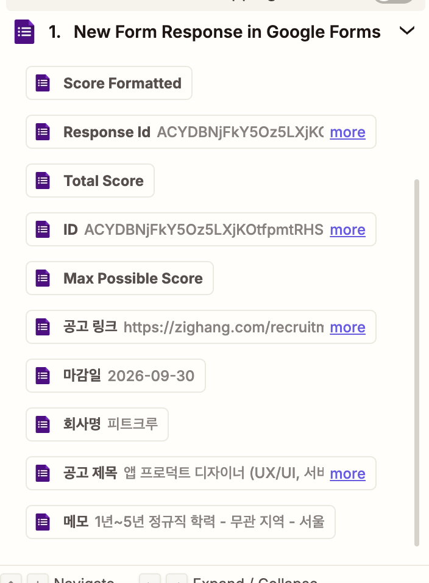

5. **조건 설정**: Path A에 `Or continue if` 그룹을 5개(UX/UI/프로덕트/Product/PD) 추가했다. Make가 한 필터 안에서 `and`/`or` 링크로 조건을 이었던 것과 달리, Zapier는 조건 그룹 자체를 여러 개 만들어 그룹끼리 OR로 연결하는 방식이었다. Zapier의 `(Text) Contains` 조건은 별도 옵션 없이 기본적으로 대소문자를 구분하지 않는다는 점도 확인했다.

   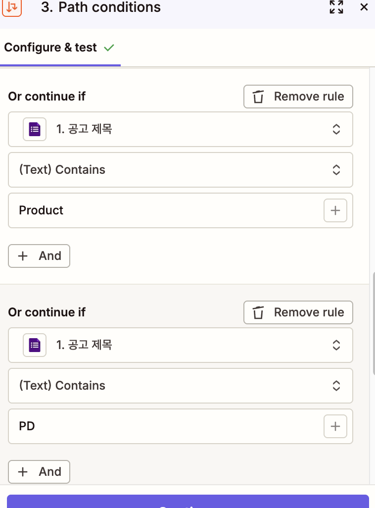

6. **액션 매핑**: Google Sheets `Create Spreadsheet Row`의 필드 매핑도 클릭 한 번으로 실제 텍스트 값이 들어갔다.

   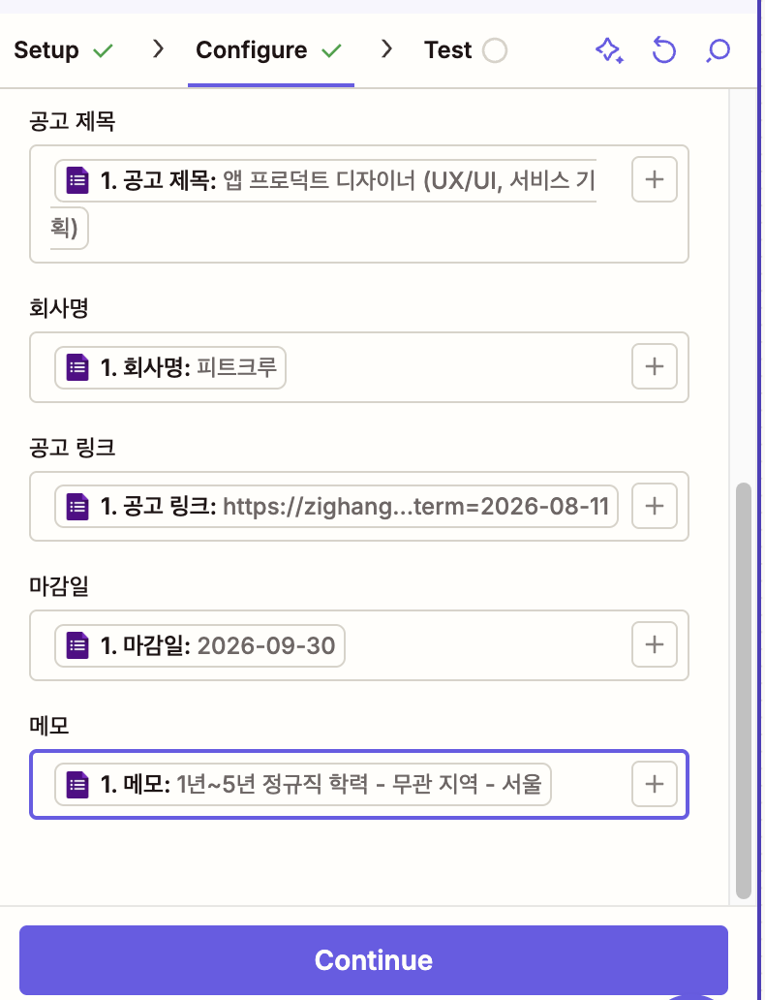

7. **Slack 연동 이슈**: 처음 `[채널명]`이라는 이름으로 Slack "채널"을 만들려다 실수로 새 "워크스페이스"(`the[채널명].slack.com`)를 만들어 `channel_not_found` 오류를 겪었다. 기존 워크스페이스 안에 채널을 다시 만들어 해결했다.

8. **활성화 및 실행 결과**: Zap을 `Publish`하자 즉시 라이브 상태가 됐고, 이후 제출한 응답은 수동 실행 없이 자동으로 처리됐다. 관심공고/보류공고 두 경로 모두 정상 동작을 확인했다.

   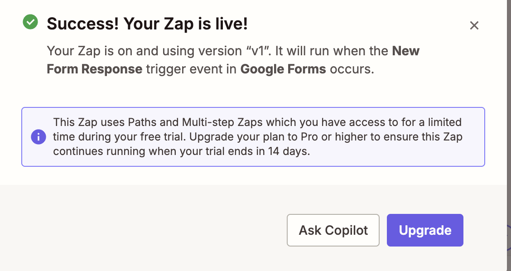
   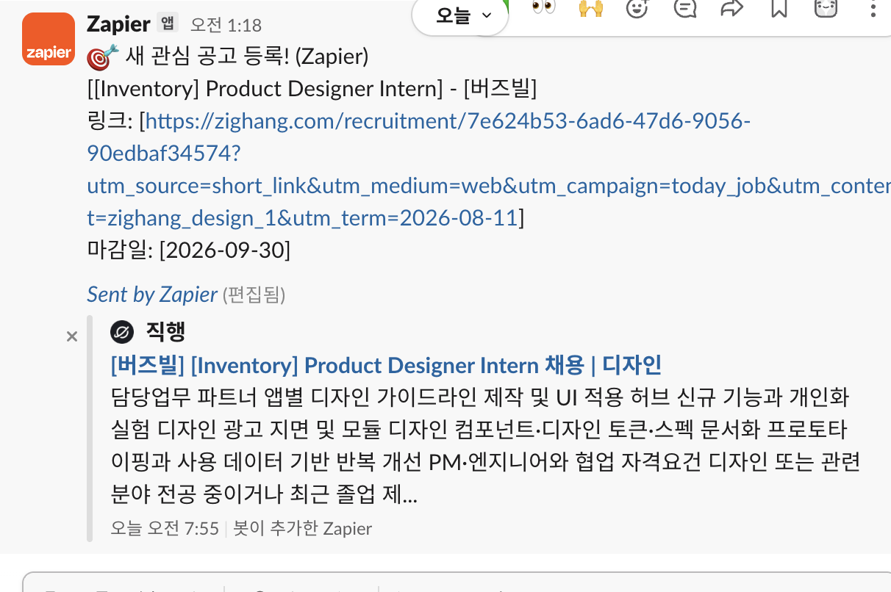
   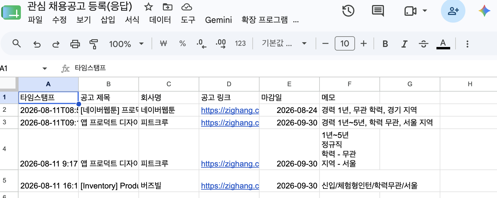

---

## 4. 비교 항목

| 비교 항목 | Make | Zapier |
|---|---|---|
| **UI/UX 방식** | 노드를 선으로 연결하는 다이어그램형 캔버스 | 위→아래 리스트 나열형 |
| **Trigger 반응 방식** | 폴링(스케줄 주기로 확인) — `Watch Responses` | 웹훅 기반 즉시 실행 — `Instant` 태그 명시 |
| **분기 기능** | Router(분기) + 개별 Filter(조건)를 따로 조합 | Paths 하나로 분기+조건이 통합, 조건 그룹 단위로 OR 결합 |
| **데이터 매핑 편의성** | API 원본 구조 그대로 노출, 중첩 데이터를 직접 여러 겹 탐색해야 함 | 필드를 미리 평탄화해서 제공, 클릭 한 번으로 실제 값 매핑 |
| **대소문자 처리** | `Contains` / `Contains (case insensitive)` 중 사용자가 직접 선택 | `Contains` 자체가 기본적으로 대소문자 구분 없음 |
| **무료 플랜 범위** | 월 1,000 Operations, 멀티스텝·분기 가능 | 월 100 Tasks, Trigger+Action 1개씩(2단계)만 가능, 분기 불가 |
| **실행 방식** | 수동(Run once) 또는 스케줄 기반 실행 | 활성화(Publish) 후 상시 자동 실행 |
| **실행 로그 확인** | 각 모듈 클릭 → Input/Output 데이터 상세 확인 가능 | 각 스텝의 Test 결과 및 Task History에서 확인 |
| **UI 내 업셀 노출** | 상대적으로 적음 | 워크플로우 제작 중간중간 유료 기능(Lead Router 등) 추천 배너가 자주 노출됨 |

---

## 5. 각 도구의 장단점

### Make

**장점**
- 무료 플랜만으로 멀티스텝 + 조건 분기 구조를 완전히 구현 가능
- 캔버스 전체를 한눈에 볼 수 있어 워크플로우 구조 파악이 직관적
- 각 모듈의 Input/Output 데이터를 상세히 열람할 수 있어 디버깅에 유리

**단점**
- Google Forms 등 일부 앱의 응답 데이터가 여러 겹으로 중첩되어 있어, 실제 값에 도달하기까지 매핑 실수가 반복되기 쉬움
- 짧은 시간에 반복 테스트하면 API 사용량 제한에 걸릴 수 있음
- Trigger가 폴링 방식이라 실시간성이 Zapier보다 떨어짐

### Zapier

**장점**
- 데이터 필드가 미리 평탄화되어 있어 매핑이 빠르고 실수가 적음
- Instant Trigger로 완전한 실시간 반응 가능
- Contains 조건이 기본적으로 대소문자를 구분하지 않아 조건 설정 시 실수 여지가 적음
- Fallback, Always run 등 조건 로직 옵션이 명확하게 구분되어 있음

**단점**
- 무료 플랜으로는 본 과제 구조(멀티스텝+분기) 구현이 불가능해 유료 체험판이 필수
- 체험 기간 종료 후에는 유료 전환 없이는 워크플로우가 멈춤
- 워크플로우 제작 중 유료 기능 추천 배너가 자주 노출되어 흐름이 끊길 수 있음

---

## 6. 어떤 상황에서 적합한가

- **예산 제약이 있고, 장기적으로 무료로 운영해야 하는 경우**: Make가 적합하다. 무료 플랜만으로 분기 구조까지 구현할 수 있어 별도 비용 없이 지속적으로 운영 가능하다.
- **실시간성이 중요한 업무(예: 문의 접수 즉시 알림)**: Zapier가 적합하다. Instant Trigger 덕분에 폴링 지연 없이 즉각 반응한다.
- **복잡한 데이터 구조를 다루는 초보자**: Zapier가 진입장벽이 낮다. 필드가 자동으로 평탄화되어 있어 API 구조를 깊이 이해하지 않아도 매핑 실수가 적다.
- **워크플로우를 세밀하게 커스터마이징하고 싶은 경우**: Make가 유리하다. Router와 Filter를 독립적으로 조합할 수 있어 자유도가 높다.

---

## 7. 참고 — 무료 플랜 제약 대응

과제 가이드의 "유료 결제가 필요한 기능을 사용했다면 무료 대안을 정리"에 따라 기록한다.

- Zapier는 무료 플랜으로 본 과제의 최소 요구사항(Action 2개 이상 + 조건 분기 1개 이상)을 충족할 수 없어 부득이하게 Professional 14일 무료 체험을 사용했다.
- 무료 대안으로는 셀프호스팅형 도구인 n8n(Community Edition, 실행 횟수 무제한)을 검토했으나, Docker 기반 설치와 상시 구동 환경이 필요해 이번 과제의 시간 제약상 제외했다.
- Make는 무료 플랜(월 1,000 Operations) 범위 내에서 전체 구현이 가능했다.
