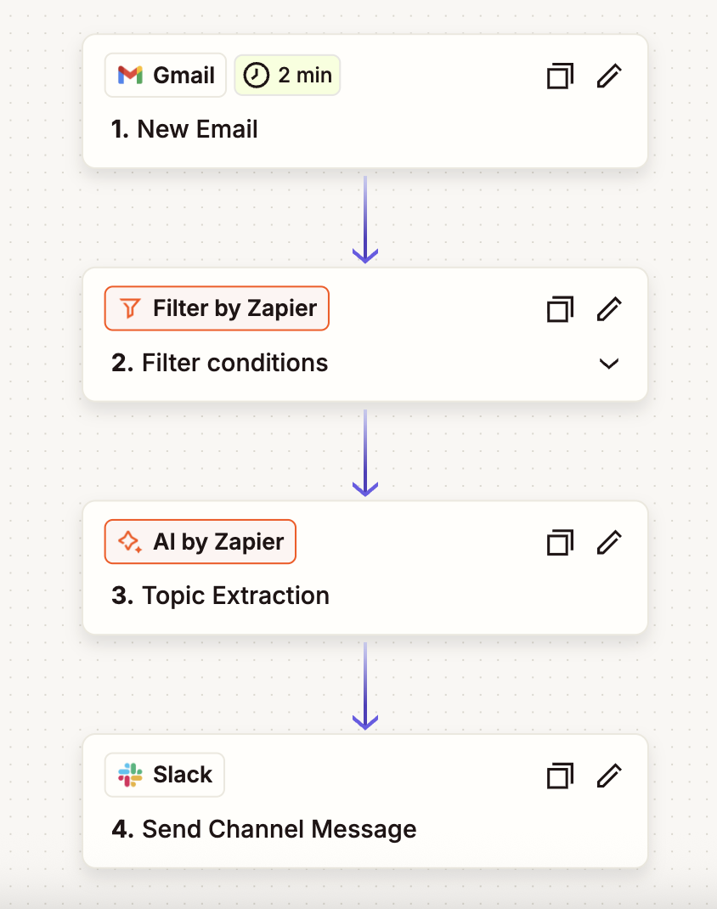
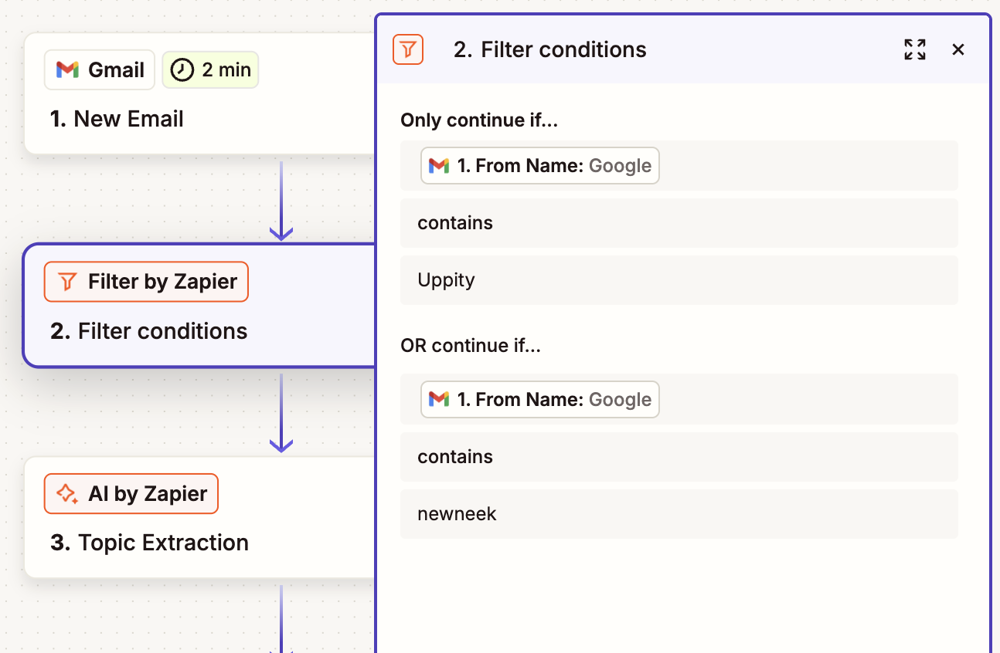
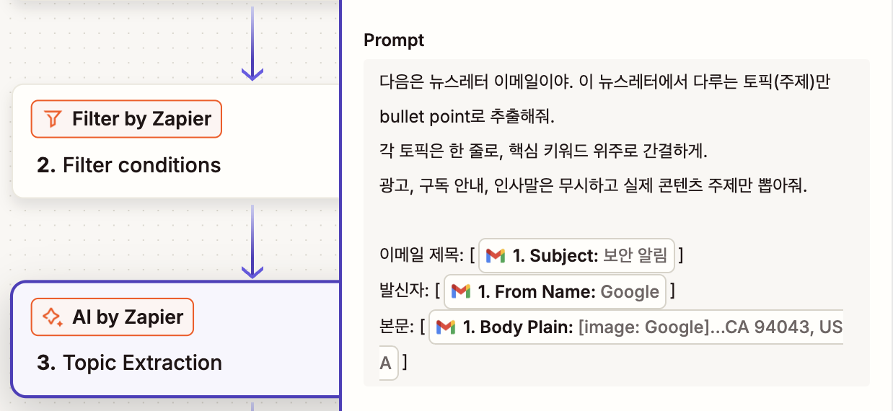
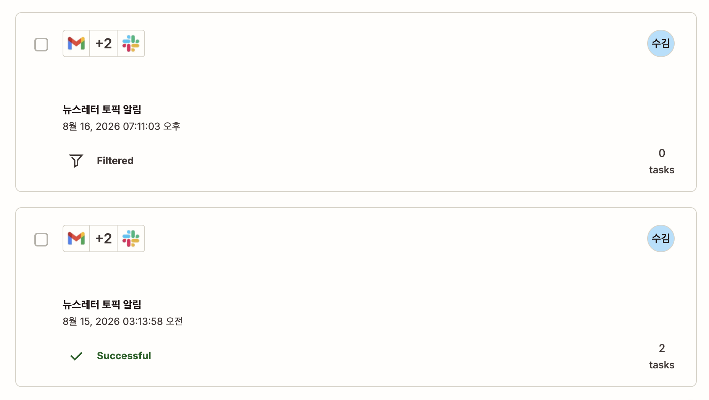
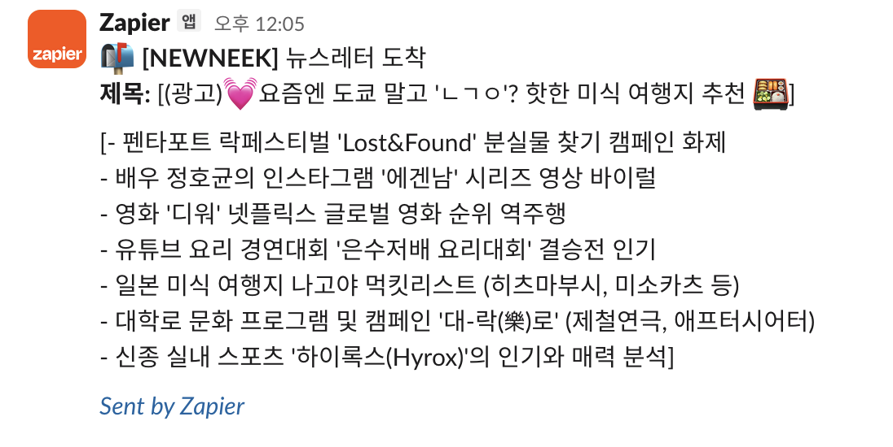
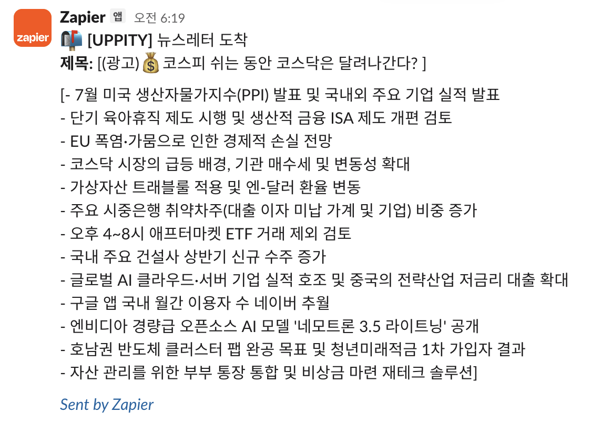

# 프로젝트 2 — 자유 주제 자동화 설계 및 구현

## 1. 반복 업무 정의

여러 채널을 통해 구독한 뉴스레터가 매일 수신되지만, 전문을 읽을 시간이 부족해 메일함에 쌓이다 결국 확인하지 못하는 문제가 반복되었다. 뉴스레터의 모든 내용을 읽는 것이 목적이 아니라, 오늘 어떤 토픽이 다뤄지는지를 빠르게 파악하고 관심 있는 것만 선택해서 읽고 싶다는 니즈가 있었다.

이에 따라 **뉴스레터 메일 수신 시 본문에서 토픽을 자동 추출하여 Slack으로 전송**하는 자동화를 설계·구현하였다.

---

## 2. 도구 선정 및 선정 이유

**선정 도구: Zapier (Professional 플랜 체험)**

| 선정 이유 | 설명 |
|---|---|
| Gmail 데이터 자동 평탄화 | Zapier는 Gmail 응답 데이터를 자동으로 평탄화하여 From Name, Subject, Body Plain 등의 필드를 별도 파싱 없이 바로 사용할 수 있다. 프로젝트 1에서 Make 사용 시 중첩 구조를 수동으로 매핑해야 했던 것과 대비된다. |
| AI by Zapier 내장 | 외부 AI API 연결 없이 Zapier 내장 AI 스텝으로 토픽 추출 프롬프트를 바로 구성할 수 있어 설정이 간결하다. |
| 리스트 기반 UI | 단계가 선형으로 이어지는 이 워크플로우는 Make의 노드 기반보다 Zapier의 리스트 기반 UI가 직관적으로 맞는다. |

---

## 3. 워크플로우 설계

### 흐름 다이어그램

```
Gmail 수신 (Trigger)
 └─ Filter by Zapier
     ├─ 조건 충족 (등록된 뉴스레터 발신자)
     │    └─ AI by Zapier: Topic Extraction
     │         └─ Slack: Send Channel Message (#소설)
     └─ 조건 미충족 (기타 메일)
          └─ 종료 (아무 Action 없음)
```

### 각 단계 설명

**Step 1 — Trigger: Gmail / New Email**
Gmail 받은편지함에 새 메일이 도착하면 Zap이 실행된다. 폴링 방식으로 약 2분 간격으로 새 메일을 감지한다.

**Step 2 — Filter by Zapier**
발신자 이름(From Name)을 기준으로 등록된 뉴스레터 발신자 여부를 판별한다.

- 조건: `From Name` contains `Uppity` **OR** `From Name` contains `newneek`
- 조건 충족 시: 다음 스텝으로 진행
- 조건 미충족 시: Zap 실행 종료 (Filtered 상태로 기록)

**Step 3 — AI by Zapier: Topic Extraction**
Filter를 통과한 메일의 본문을 AI에 전달하여 토픽을 추출한다.

프롬프트:
```
다음은 뉴스레터 이메일이야. 이 뉴스레터에서 다루는 토픽(주제)만 bullet point로 추출해줘.
각 토픽은 한 줄로, 핵심 키워드 위주로 간결하게.
광고, 구독 안내, 인사말은 무시하고 실제 콘텐츠 주제만 뽑아줘.

이메일 제목: [Subject]
발신자: [From Name]
본문: [Body Plain]
```

**Step 4 — Slack: Send Channel Message**
추출된 토픽 목록을 아래 형식으로 Slack `#소설` 채널에 전송한다.

```
📚 *[발신자명]* 뉴스레터 도착
*제목:* [이메일 제목]

[AI 추출 토픽 목록]
```

---

## 4. 모듈화 전략

이 워크플로우는 각 단계를 역할 기준으로 독립된 모듈로 분리하여 설계하였다.

| 모듈 | 역할 | 단위 |
|---|---|---|
| Trigger | 외부 이벤트 감지 (Gmail 수신) | 데이터 수집 |
| Filter | 처리 대상 판별 (뉴스레터 여부) | 조건 분기 |
| AI by Zapier | 본문 분석 및 토픽 추출 | 데이터 가공 |
| Slack | 결과 전송 | 출력 |

### 모듈 분리 기준

각 모듈은 **단일 책임 원칙**에 따라 분리하였다. 하나의 모듈이 하나의 역할만 수행하도록 설계함으로써, 특정 단계를 수정하거나 교체할 때 다른 단계에 영향을 주지 않는다.

- **복잡도 임계값**: 하나의 스텝에서 데이터 수집·판별·가공·출력이 동시에 일어날 경우 분리 대상으로 판단. 이 워크플로우는 4개 역할이 명확히 구분되어 각각 독립 모듈로 설계하였다.
- **재사용 인터페이스 기준**: 각 모듈의 입출력 필드를 표준화하였다. Filter는 `From Name` 필드만 참조하고, AI 모듈은 `Subject` · `From Name` · `Body Plain` 3개 필드만 입력받으며, Slack 모듈은 AI 출력값만 수신한다. 이를 통해 Trigger를 Gmail 외 다른 메일 서비스로 교체하더라도 동일한 필드 구조를 유지하면 하위 모듈을 그대로 재사용할 수 있다.
- **단계 분리 효과**: 예를 들어 Slack 대신 Notion으로 출력 채널을 변경하고자 할 경우, Step 4만 교체하면 되며 나머지 모듈은 수정 없이 유지된다. AI 프롬프트를 요약 방식으로 변경하고 싶을 경우에도 Step 3만 수정하면 된다.

---

## 5. 구현 화면 캡처

> 아래 캡처는 실제 구현 화면이다.

### Zap 전체 구조



### Filter 조건 설정

- Field: `From Name`
- Condition: `contains`
- Value: `Uppity` / `newneek` (OR 조건)



### AI by Zapier 프롬프트 설정



---

## 6. 실행 결과 화면

### Zap History — 분기 경로별 실행 기록

Successful (뉴스레터 메일 → 전체 플로우 실행)과 Filtered (기타 메일 → Filter에서 종료) 두 경로 모두 실행 검증 완료.



### Slack 수신 결과

NEWNEEK 뉴스레터와 UPPITY 뉴스레터 각각에 대해 토픽이 정상 추출되어 전송됨.




---

## 7. 보너스 과제 — AI 연동 Action

Step 3에서 **AI by Zapier**를 Action으로 추가하여 뉴스레터 본문에서 토픽을 자동 추출하였다. 외부 API 키 없이 Zapier 내장 AI 기능을 활용하였으며, 프롬프트에서 광고·인사말 제외 조건을 명시하여 실제 콘텐츠 토픽만 추출되도록 설계하였다.

---

## 8. 한계 및 개선 가능성

| 한계 | 개선 방안 |
|---|---|
| Filter 조건이 발신자 이름 기반이라 신규 뉴스레터 추가 시 조건을 수동으로 업데이트해야 한다 | 별도 시트에 허용 발신자 목록을 관리하고 Lookup으로 동적 비교하는 구조로 개선 가능 |
| Gmail 폴링 주기가 최소 2분으로 실시간성이 없다 | 뉴스레터 특성상 실시간성이 불필요하므로 실사용에는 문제 없음 |
| Zapier Professional 체험 만료 시 무료 플랜(2단계 제한)으로 전환되어 Zap이 중단된다 | 체험 만료 전 Make로 동일 워크플로우 이식 가능. Make 무료 플랜은 시간 제한 없이 월 1,000 오퍼레이션 제공 |
